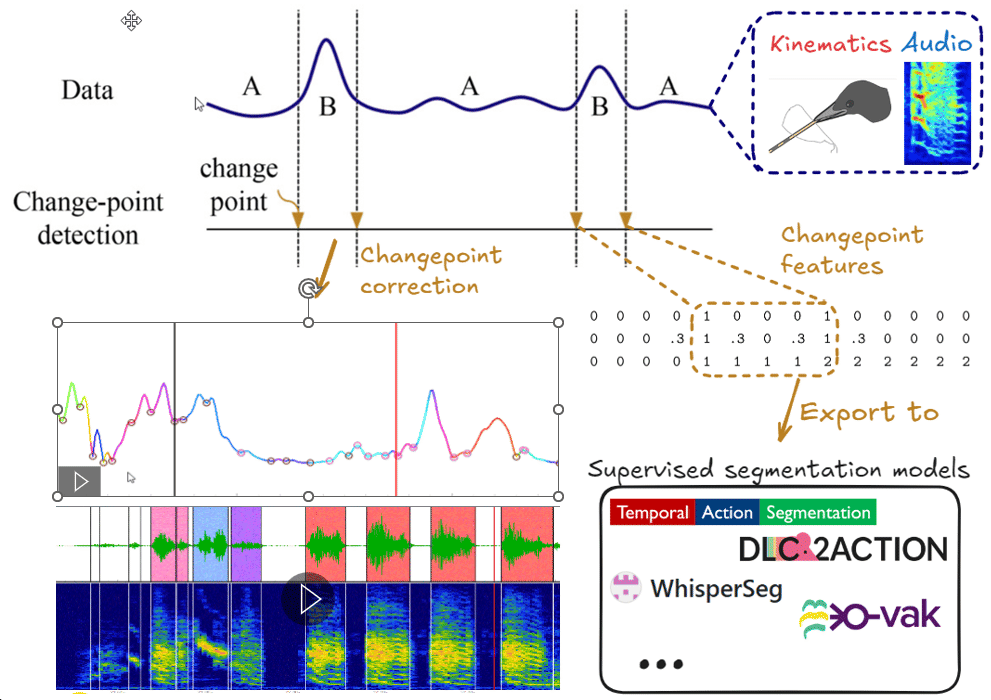
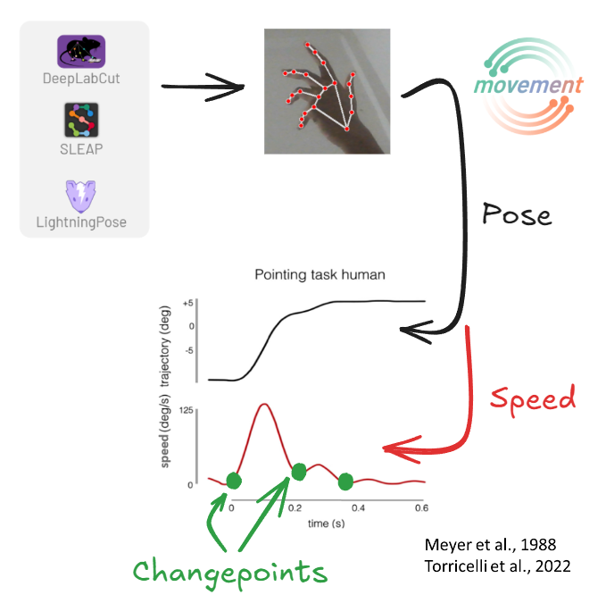
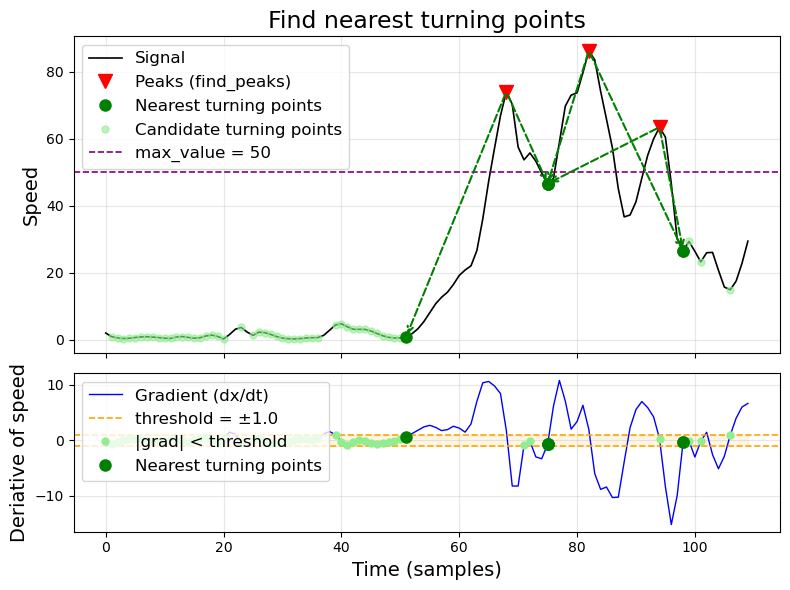

# Changepoints

Changepoint detection methods (Xu et al., 2025) allow finding transitions in time series data. This can be leveraged to identify **candidates** of action boundaries in various data foramts (kinematic, audio, spectral).

---

Ethograph uses changepoints in two ways:

1) The GUI can compute changepoints and mark them visually in a time series plot (e.g. as circles or vertical lines). When a user labels the onset/offset of a behaviour by clicking on the time series, their click is refined by jumping to the nearest changepoint. For example, when labelling the onset of a movement, the user may click close to a speed minima, and then GUI will refine the selection to jump exactly to that minima. This increases the accuracy and consistency of human labelling.

2) Changepoint detection methods often have a false positive detection problem (Cohen, 2022), where a large subset of the detections are not at real behavioural boundaries but false positives. Similarly, the changepoint algorithms below often **overspecify** by providing too many changepoints. The human-in-the-loop through labelling can then specify which of these detections are **good candidates**. Next, these changepoint times are converted into learnable [changepoint features](#changepoint-features), and exported along with human behavioural labels to supervised segmentation models (e.g. transformers). By receiving all changepoints along with human labels, these models can learn when certain changepoint features co-occur with behavioural boundaries, thus also refine their segmentation accuracy on unseen data.

## Kinematic Changepoints

One example for changepoints occuring at behavioural boundaries are speed minima. In point-to-point reaching tasks, the hand speed profile is characterised by a unimodal bell-shaped curve with two speed minima (Torricelli et al., 2023), where the minima correspond to the onset and offset of the movement, and the peak of the speed bump marks the point where the hand starts decelerating. These minima can even be used to identify sub-movements, such as the small second corrective speed bump in the figure below (Meyer et al., 1988).

### Troughs (local minima)

Finds local minima in the signal using `scipy.signal.find_peaks` applied to the negated signal. Troughs in speed often correspond to moments where an animal pauses or reverses direction.

Parameters are passed directly to [`scipy.signal.find_peaks`](https://docs.scipy.org/doc/scipy/reference/generated/scipy.signal.find_peaks.html): `height`, `distance`, `prominence`, `width`, etc.

### Turning points

A custom algorithm that identifies the boundaries of peak regions rather than the peaks themselves. The idea is that behaviour transitions happen not at the peak of a movement, but where the animal starts or stops accelerating. Below is a visual explanation:

The algorithm works in four steps:

1. **Compute the gradient** of the signal and find all indices where `|gradient| < threshold` — these are candidate turning points (near-stationary regions, shown as light green dots).
2. **Find peaks** in the original signal using `scipy.signal.find_peaks` with `prominence` and `width` parameters (red triangles).
3. **For each peak**, select the closest candidate turning point to its left and right (green circles). These define the boundaries of the peak region.
4. **Filter by `max_value`**: any candidate turning point where the signal exceeds `max_value` is discarded (purple dashed line). This prevents selecting turning points on high speed plateaus. 

**Parameters:**

| Parameter | Description |
|-----------|-------------|
| `threshold` | Maximum absolute gradient to qualify as a turning point. Lower = only very flat regions. |
| `max_value` | Discard turning points where signal exceeds this value. |
| `prominence` | Minimum peak prominence (passed to `find_peaks`). |
| `distance` | Minimum distance between peaks (passed to `find_peaks`). |

All kinematic changepoints also include NaN-boundary markers — transitions between valid data and NaN gaps are automatically added as changepoints.

### Usage

1. Select a feature in the Data Controls (e.g. `speed`)
2. Open the **Kinematic CPs** panel
3. Choose a method (`troughs` or `turning_points`)
4. Click **Configure...** to adjust parameters
5. Click **Detect**

The changepoints are stored in the dataset as `{feature}_{method}` (e.g. `speed_troughs`) and persist when you save.

---

## Audio Changepoints

For audio data or high-sample-rate periodic signals (loaded as `.wav` file).

Four methods are available, drawn from two libraries:

### VocalPy methods

Reference: [VocalPy documentation](https://vocalpy.readthedocs.io/)

**Mean-squared energy** (`meansquared`): Computes a smoothed energy envelope via mean-squared amplitude, then thresholds to find vocal segments. Simple and fast.

**AVA** (`ava`): The segmentation method from the Animal Vocalization Analysis pipeline. Uses a spectrogram-based approach with multiple threshold levels. 

### VocalSeg methods

Reference: [VocalSeg (Sainburg et al., 2020)](https://github.com/timsainb/vocalization-segmentation)

**Dynamic thresholding** (`vocalseg`): Adaptive threshold segmentation that adjusts to local spectral energy. Good for signals with varying background noise.

**Continuity filtering** (`continuity`): Extends dynamic thresholding with temporal continuity constraints to merge fragmented detections.

### Usage

1. Open the **Audio CPs** panel
2. Choose a method and click **Configure...** to adjust parameters
3. Click **Detect**

Detected onsets and offsets are drawn as vertical lines on the plot and stored in the dataset as `audio_cp_onsets` / `audio_cp_offsets`.

---

## Ruptures

Reference: [Ruptures (Truong et al., 2020)](https://centre-borelli.github.io/ruptures-docs)

General-purpose changepoint detection using the `ruptures` library. Five search methods are available:

| Method | Description |
|--------|-------------|
| **Pelt** | Penalty-based, fast. Good when the number of changepoints is unknown. |
| **Binseg** | Binary segmentation. Fast recursive splitting. |
| **BottomUp** | Bottom-up merging of segments. |
| **Window** | Sliding window approach. |
| **Dynp** | Dynamic programming. Optimal but slow on long signals. |

Each method supports a cost model (`l2`, `l1`, `rbf`, etc.) and parameters like `min_size`, `jump`, and either `pen` (penalty) or `n_bkps` (fixed number of breakpoints).

**Note:** Ruptures detection has not been tested as extensively as the kinematic and audio methods. Results may vary — check visually and adjust parameters as needed.

### Usage

1. Select a feature in Data Controls
2. Open the **Ruptures** panel
3. Choose a method and click **Configure...**
4. Click **Detect**

---

## Changepoint Correction

Once changepoints are detected, they can be used to refine label boundaries. The correction pipeline snaps hand-drawn label edges to nearby changepoints, producing more consistent annotations.

### How it works

The correction runs four steps in sequence:

1. **Purge short intervals** — remove labels shorter than the minimum duration
2. **Stitch gaps** — merge adjacent same-label intervals separated by a small gap
3. **Snap boundaries** — move each label's start/end to the nearest changepoint, constrained by maximum expansion/shrink limits
4. **Purge short intervals** (again) — snapping may create new short intervals

### Parameters

| Parameter | Description |
|-----------|-------------|
| **Min label length** | Labels shorter than this are removed. |
| **Stitch gap** | Maximum gap between same-label segments to merge. |
| **Max expansion** | How far a boundary can move outward toward a changepoint. |
| **Max shrink** | How far a boundary can move inward toward a changepoint. |
| **Per-label thresholds** | Override the global min label length for specific label classes. |

These four parameters can be set in frames or seconds. I would recommend using frames for kinematics and seconds for audio data. 

### Automatic vs manual correction

- **Checkbox "Changepoint correction"**: When enabled, label boundaries are snapped to changepoints as you create them.
- **Single Trial**: Applies the full correction pipeline to the current trial's labels.
- **All Trials**: Applies correction to every trial. The dataset is marked as corrected to prevent double-application.
- **Undo**: Reverts the last correction (single or all trials).

## Changepoint features

The code for changepoint features exist in `ethograph.features.changepoints`, but the export functionality is still missing. 

## References

- Cohen, Y., Nicholson, D. A., Sanchioni, A., Mallaber, E. K., Skidanova, V., & Gardner, T. J. (2022). Automated annotation of birdsong with a neural network that segments spectrograms. eLife, 11, e63853. https://doi.org/10.7554/eLife.63853
- Gu, N., Lee, K., Basha, M., Kumar Ram, S., You, G., & Hahnloser, R. H. R. (2024). Positive Transfer of the Whisper Speech Transformer to Human and Animal Voice Activity Detection. ICASSP 2024 - 2024 IEEE International Conference on Acoustics, Speech and Signal Processing (ICASSP), 7505–7509. https://doi.org/10.1109/ICASSP48485.2024.10447620
- Kozlova, E., Bonnetto, A., & Mathis, A. (2025). DLC2Action: A Deep Learning-based Toolbox for Automated Behavior Segmentation (p. 2025.09.27.678941). bioRxiv. https://doi.org/10.1101/2025.09.27.678941
- Meyer, D. E., Abrams, R. A., Kornblum, S., Wright, C. E., & Keith Smith, J. E. (1988). Optimality in human motor performance: Ideal control of rapid aimed movements. Psychological Review, 95(3), 340–370. https://doi.org/10.1037/0033-295X.95.3.340
- Nicholson, D. (2023). vocalpy/vocalpy: 0.2.0 [Computer software]. Zenodo. https://doi.org/10.5281/zenodo.7905426
- Nicholson, D., & Cohen, Y. (2023). vak: A neural network framework for researchers studying animal acoustic communication. Scipy 2023. https://doi.org/10.25080/gerudo-f2bc6f59-008
- Sainburg, T., Thielk, M., & Gentner, T. Q. (2020). Finding, visualizing, and quantifying latent structure across diverse animal vocal repertoires. PLOS Computational Biology, 16(10), e1008228. https://doi.org/10.1371/journal.pcbi.1008228
- Torricelli, F., Tomassini, A., Pezzulo, G., Pozzo, T., Fadiga, L., & D’Ausilio, A. (2023). Motor invariants in action execution and perception. Physics of Life Reviews, 44, 13–47. https://doi.org/10.1016/j.plrev.2022.11.003
- Xu, R., Song, Z., Wu, J., Wang, C., & Zhou, S. (2025). Change-point detection with deep learning: A review. Frontiers of Engineering Management, 12(1), 154–176. https://doi.org/10.1007/s42524-025-4109-z
