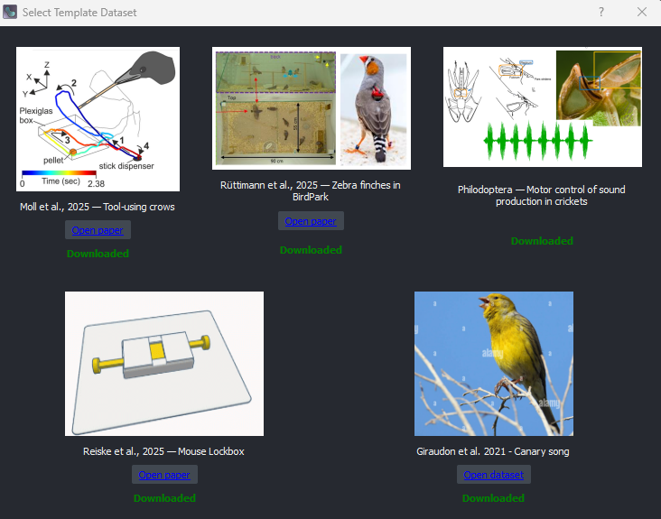

# Loading Data

EthoGraph works with NetCDF (`.nc`) session files. You can either load a pre-made `trials.nc`[^1] or create one from your own data using the built-in creation dialog. `trials.nc` files allow you to store behavioural data, labels and meta data from a multi trial session all in **one file**.

---

## Try the GUI with template datasets

The quickest way to "try out" the GUI is click **Select templates** in the I/O widget, pick a dataset, and click **Load**.



---


## Option 1: Load a pre-made trials.nc

If you already have a `trials.nc` file (e.g. from an ethograph pipeline or [custom scripts](#6-tutorials-for-custom-nc-files):

1. In the `I/O` widget, select your session data **file** (`.nc`)
2. Select the video **folder** containing camera recordings (`.mp4`) [^4]
3. [Optional] Select the audio **folder** containing microphone recordings `.wav`, `.mp3`, `.mp4` [^2]
4. [Optional] Select the tracking **folder** containing pose estimation files (`.h5`, `.csv`) [^3]

TODO:
- rewrite with clearer logic for ephys, vs kilosort

5. [Optional] Select the ephys **file** (`.rhd`, `.abf`) 
6. [Optional] Select the kilosort folder
5. Click `Load` to load the dataset and populate the interface

---

## Option 2: Create a trials.nc from your own data

If you don't have a `trials.nc` file yet, click the **Create trials.nc** button in the `I/O` widget. A dialog will guide you through creating one from several supported data sources.

After generation, the I/O fields are auto-populated so you can click `Load` immediately.

**Note**: The dialog window only works for single video/pose/audio files. If you want to load in multiple videos (i.e. for multiple trials), see [Custom scripts](#6-tutorials-for-custom-nc-files).


### Common fields

These fields appear across most formats. Format-specific sections below only list what's *different*.

| Field | Description |
|-------|-------------|
| **Video file** | Path to video file (`.mp4`) [^4]. |
| **Video frame rate** | Frames per second. Auto-detected from video when possible. |
| **Individuals** | Comma-separated list of individual names (e.g. `bird1, bird2`). Optional. |
| **Video motion features** | Extracts a frame-to-frame motion intensity signal from the video using FFmpeg. |
| **Output path** | Where to save the generated `trials.nc`. Required for all formats. |

### Format overview

| Format | When to use | Key inputs |
|--------|-------------|------------|
| [Pose file](#1-from-a-pose-file) | Pose estimation output (DLC, SLEAP, ...) | Source software, pose file |
| [Xarray dataset](#2-from-an-xarray-dataset) | [Movement](https://movement.neuroinformatics.dev/latest/user_guide/movement_dataset.html)-style `.nc` | Dataset file |
| [Audio file](#3-from-an-audio-file) | Vocal / acoustic data | Audio file, sample rate |
| [Numpy file](#4-from-a-numpy-file) | Pre-computed feature array | `.npy` file, data sample rate |
| [Ephys recording](#5-from-an-ephys-recording) | Electrophysiology ± spike sorting | Ephys file and/or Kilosort folder |
| [Custom scripts](#6-tutorials-for-custom-nc-files) | Advanced / programmatic | See tutorials |

---

### 1) From a pose file

Use this if you have pose estimation output from tracking software (DeepLabCut, SLEAP, LightningPose, etc.). Besides position, this loader will automatically compute kinematic features such as velocities, accelerations, and speed for each keypoint. This may be helpful for identifying action boundaries. See also [kinematic changepoints](https://ethograph.readthedocs.io/en/latest/changepoints/#kinematic-changepoints).

- **Source software**: Select the software that generated the file
- **Pose file**: Path to the pose file (`.h5`, `.csv`)

### 2) From an xarray dataset

Use this if you have a [Movement](https://movement.neuroinformatics.dev/latest/user_guide/movement_dataset.html)-style xarray dataset saved as `.nc`.

- **Dataset file**: The Movement-style `.nc` file

### 3) From an audio file

Use this if you have audio data (e.g. animal vocalizations). If your `.mp4` video contains audio, you can use that same file as the audio source.

- **Audio file**: Path to audio file (`.wav`, `.mp3`, `.mp4`, `.flac`)
- **Audio sample rate**: Sampling rate of the audio (auto-detected)

### 4) From a numpy file

Use this if you have pre-computed features stored as a numpy array. The file should contain a 2D array with shape `(n_samples, n_variables)` or `(n_variables, n_samples)`. The longer dimension is assumed to be `n_samples`.

- **Npy file**: Path to `.npy` file
- **Data sampling rate**: Sampling rate of the numpy data (Hz)

### 5) From an ephys recording

Use this if you have extracellular electrophysiology data, optionally with Kilosort spike-sorting output. At least one of ephys file or Kilosort folder is required.

- **Ephys file**: Raw recording file. Supported formats:
  - **With headers** (auto-detected SR & channels): `.rhd`/`.rhs` (Intan), `.oebin` (OpenEphys), `.nwb` (NWB), `.ns5`/`.ns6`/`.nev` (Blackrock), `.abf` (Axon), `.edf`/`.bdf` (EDF), `.vhdr` (BrainVision)
  - **Raw binary** (must set SR & channels manually): `.dat`, `.bin`, `.raw`
- **Kilosort folder**: Path to Kilosort output directory (must contain `params.py`). Auto-detected if a `kilosort4/` folder exists next to the ephys file.
- **Ephys sampling rate**: Auto-detected from file or Kilosort `params.py`. Manual override for raw binary files. Default 30000 Hz.
- **N channels**: Auto-detected for known formats. Manual for raw binary. Default 1.
- **Audio file** (optional): Path to audio file (`.wav`, `.mp3`, `.mp4`)
- **Audio sample rate**: Auto-detected from audio file.
- **Video onset in ephys**: Time offset (seconds) where video starts relative to ephys recording. Default 0.
- **Audio onset in ephys**: Time offset (seconds) where audio starts relative to ephys recording. Default 0.

Video, audio, and individuals are all optional — ephys-only datasets are supported.

For standard GUI loading, EthoGraph expects an ephys file path rather than an ephys folder. When you pick an ephys file in the I/O widget, EthoGraph looks for a sibling `kilosort4/` or `kilosort/` directory next to that file and fills the Kilosort field automatically when found. These two paths are stored only in `.ethograph/local_settings.yaml`, not in the `trials.nc` dataset itself.

### 6) Tutorials for custom .nc files

The data loading methods above allow you to get started quickly. To trugly leverage the Ethograph GUI, we recommend programatically creating `.nc` files with custom features, metadata, and multiple video/audio/pose files. To get going look at:

- the [TrialTree](trialtree.md) wrapper
- the [data format requirements](data_requirements)
- and some [tutorial notebooks](tutorials), where I created a `.nc` file with my own data or converted public datasets into this format.

---

## Folder Structure

```
processed_data/
    └── ses-20220509/
        ├── trials.nc                 # Main behavioral dataset (required)
        └── labels/                    # Temporary label files (created by GUI)
            ├── session_labels_20240315_143022.nc
            └── session_labels_20240316_091045.nc
rawdata/
└── ses-20220509/
    ├── video/
    │   ├── camera1_trial001.mp4     # Camera recordings (optional)
    │   ├── camera1_trial002.mp4
    │   ├── camera2_trial001.mp4
    │   └── camera2_trial002.mp4
    ├── tracking/                    # Pose estimation files (optional)
    │   ├── trial001_pose.h5
    │   ├── trial001_pose.csv
    │   └── ...
    ├── audio/                       # Microphone recordings (optional)
    │   ├── mic1_trial001.wav
    │   ├── mic1_trial002.wav
    │   └── ...
    ├── ephys/                       # Electrophysiology recordings (optional)
        ├── recording.rhd
        └── kilosort4/
            ├── params.py
            ├── spike_times.npy
            ├── spike_clusters.npy
            ├── channel_positions.npy
            ├── channel_map.npy
            ├── templates.npy
            └── cluster_info.tsv

```
[^1]: `trials.nc` is just an example file name, you may call it differently.

[^2]: If your video files (e.g. `.mp4`) contain audio, the video and audio folder will be the same.

[^3]: Loading of pose estimation points and tracks occurs via the `movement` library. See [Movement IO](https://movement.neuroinformatics.dev/latest/user_guide/input_output.html).

[^4]: You can technically also load `.avi` and `.mov` files, but they have inaccurate frame seeking (off by 1-2 frames). For best results, transcode to `.mp4` with H.264. See [Troubleshooting](troubleshooting.md).
