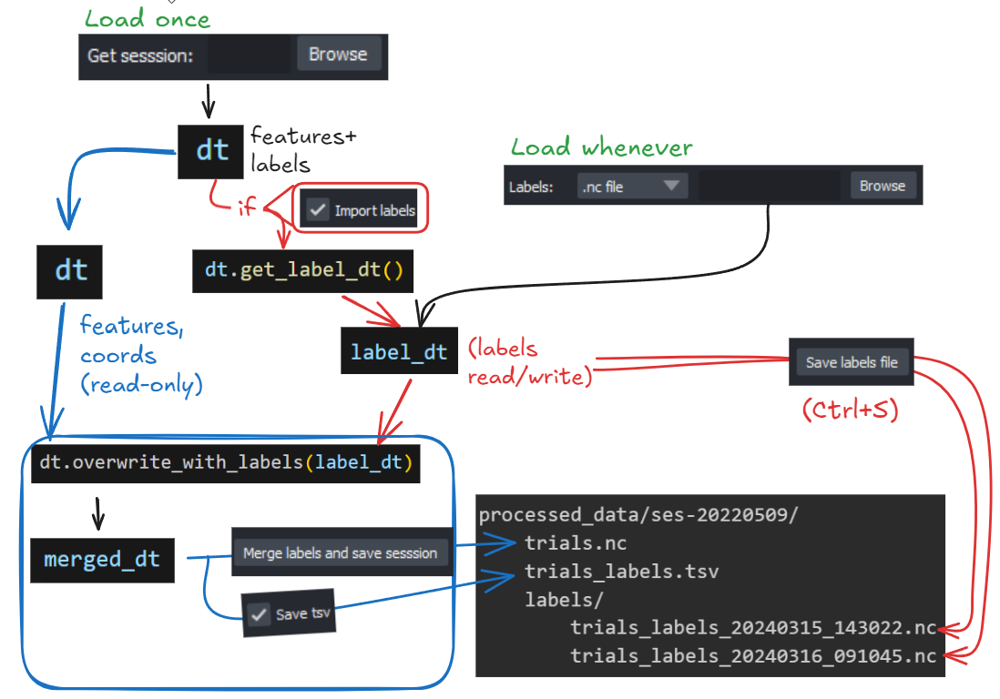

# Export/Import of Labels



In the GUI, there are two [TrialTree](trialtree.md) objects. There is `dt`, which stores everything (feature data, coords, metadata, and labels). And there is `label_dt`, which stores labels (editable). This separation ensures feature data is never at risk of being modified, and allows importing/editing different labels/predictions files without immediately overwriting the main `trials.nc` file

---

## Save labels file (Ctrl+S)

Saves a timestamped backup of `label_dt` to a `labels/` subfolder. Does **not** modify the original `trials.nc` file.

---

## Merge labels and save session

Rejoins `label_dt` back into `dt` via `overwrite_with_labels()`, then overwrites the original `trials.nc` file. If **"Save tsv"** is checked, a `trials_labels.tsv` is written alongside it.

## Importing labels

Once you have labelled a session, you can open those labels in two ways. 

1) If you clicked `merge labels and save session`, your `trials.nc` now contains the up-to-date labels. If the `Import labels` checkbox is ticked, these will be automatically imported during data loading.

2) In I/O controls, you can directly import the labels. You have a few options:
    - Import a timestamped backup from `labels/` subfolder.
    - Import a predictions file generated by the model (in development).
    - Use [crowsetta](https://crowsetta.readthedocs.io/) to import audio labels from various formats (Audacity, Praat, Raven, ...).
    - If you forgot to click `Import labels`, you can also select the `trials.nc` file, which will use `dt.get_label_dt()` to import the labels.
    


## TSV export format

`trees_to_df()` converts interval labels into a flat DataFrame with one row
per labelled segment (background / label 0 is excluded). Any trial condition
attributes (see [Data Requirements](data-requirements.md#trial-condition-attributes-optional))
are included as extra columns.

### Example

Given a session with 3 trials, two individuals, and a `stimulus` trial
condition:

TODO: Does this logic work given dt.session is not necessarily stored in label_dt?, check

```python
import ethograph as eto

dt = eto.open("trials.nc")
label_dt = dt.get_label_dt()

df = eto.trees_to_df(label_dt, keep_attrs=["stimulus"])
print(df.to_string(index=False))
```

| session | trial | individual | labels | onset_s | offset_s | duration | sequence_idx | sequence | stimulus |
|---------|-------|------------|--------|---------|----------|----------|--------------|----------|----------|
|         | 1     | mouse1     | 1      | 2.10    | 3.45     | 1.35     | 0            | 1-2-1    | tone_A   |
|         | 1     | mouse1     | 2      | 4.00    | 5.20     | 1.20     | 1            | 1-2-1    | tone_A   |
|         | 1     | mouse1     | 1      | 6.80    | 8.10     | 1.30     | 2            | 1-2-1    | tone_A   |
|         | 2     | mouse1     | 1      | 1.50    | 2.90     | 1.40     | 0            | 1-3      | tone_B   |
|         | 2     | mouse1     | 3      | 5.00    | 6.25     | 1.25     | 1            | 1-3      | tone_B   |
|         | 3     | mouse1     | 2      | 0.80    | 2.10     | 1.30     | 0            | 2        | tone_A   |

### Column descriptions

| Column | Description |
|--------|-------------|
| `session` | From `ds.attrs["session"]` (empty string if absent). |
| `trial` | Trial identifier from the TrialTree. |
| `individual` | Subject name from the interval label. |
| `labels` | Integer label class (0 = background is excluded). |
| `onset_s` | Segment start in trial-relative seconds. |
| `offset_s` | Segment end in trial-relative seconds. |
| `start_time` | Absolute trial start in session time (only present when the TrialTree session table contains `start_time`). |
| `onset_global` | `start_time + onset_s` -- segment start in absolute session time. |
| `offset_global` | `start_time + offset_s` -- segment end in absolute session time. |
| `duration` | `offset_s - onset_s` in seconds. |
| `sequence_idx` | Position of this segment within the trial's label sequence. |
| `sequence` | Dash-joined string of all label IDs in the trial (e.g. `"1-2-1"`). Useful for sequence analysis. |
| *(extra)* | Any keys passed via `keep_attrs` (e.g. `stimulus`, `num_pellets`) are appended as columns from `ds.attrs`. |

The `start_time`, `onset_global`, and `offset_global` columns only appear
when the TrialTree has a session table (via `dt.session`) containing `start_time`. For purely
video/audio sessions without session-absolute timing, these columns are absent.

---

## Programmatic usage

You can also call `trees_to_df()` directly in a script:

```python
import ethograph as eto

dt = eto.open("trials.nc")

df = eto.trees_to_df(dt, keep_attrs=["stimulus", "num_pellets"])
df.to_csv("labels_export.tsv", sep="\t", index=False)
```
