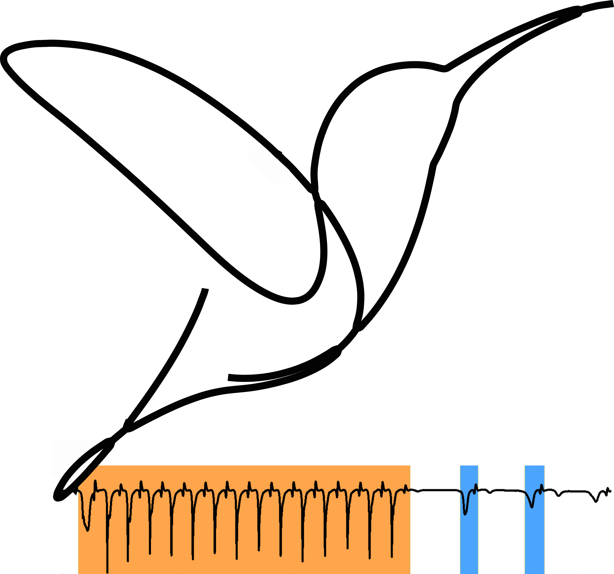

<h1 style="display: flex; align-items: center; gap: 12px; font-size: 30px;">
  
  EthoGraph
</h1>

EthoGraph is a graphical user interface (GUI) made for visualizing and segmenting multimodal times series behavioural data.

It is built upon the Python frameworks [napari](https://www.napari.org), [PyQtGraph](https://www.pyqtgraph.org/), and [movement](https://movement.neuroinformatics.dev) and [audian](https://github.com/bendalab/audian). The combination of Napari, PyQtGraph and Audian enables a fast, interactive and synchronised interface for videos and time series plots and spectrograms. The data backend builds upon the Movement library to conveniently index multi-dimensional data across trials,  individuals, keypoints, space, and time.

The GUI (and this documentation) is still under development. 

