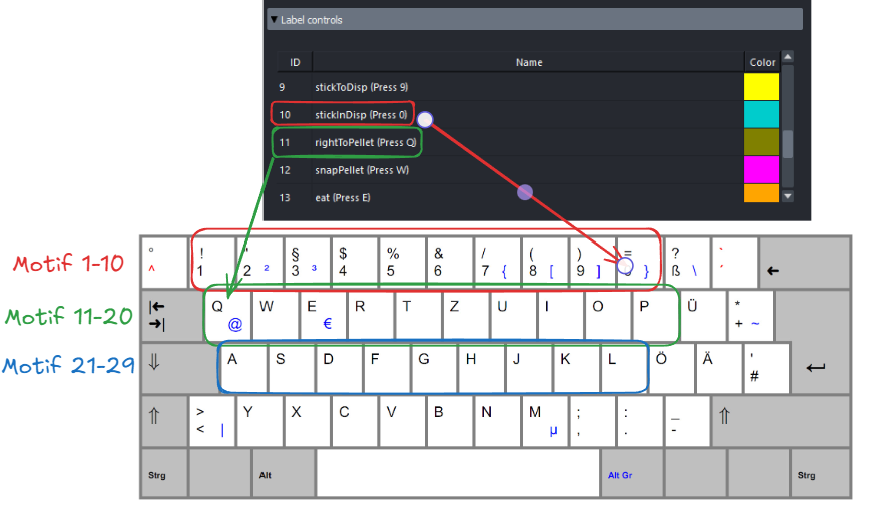

# Labelling

TODO: mention something about labels -> behavioural motifs, syllables/etc (onset/offsets)

Before closing, you will be prompted to `update with labels and save`, this takes `labels.nc` file and udpates the `sesssion` file with this info. Don't skip this step, may take a minute!

## Creating Labels

To create a new behavioural label:

1. Press one of the keys above to activate a specific behavioural label.
2. Click twice on the line plot to define the start and end boundaries of the label
3. The label will be created and displayed with a color-coded overlay

## Playing Back Labels

Once you've created label, you can click on the label, press `v` to play the segment.

- Note: How you can also use `←`, `→` to navigate individual frames, or ight-click to jump to specific timepoints. Over time you may find this faster than playing the video.

## Editing and Deleting Labels

You can edit or delete existing labels using the labels widget interface:

- **Edit**: Select a label (Left-click), press `Ctrl + E`, then click twice to define new start/stop boundary
- **Delete**: Select a label (Left-click), press `Ctrl + D` to delete.

## Changepoint Correction

- Note how in the video above you can turn off/on the Changepoint correction.

See [Changepoints](changepoints.md) for full documentation on detection methods and correction parameters.
